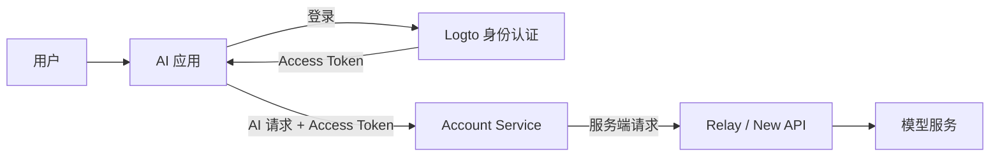

  

<h1 align="center">重庆 AI 创享俱乐部</h1>

  <strong>在重庆，做 AI。让交流产生想法，让共创带来作品。</strong> 
  Chongqing AI Innovation Club · Learn, build &amp; create together.

  <a href="https://cqaiclub.asia/">俱乐部官网</a> &nbsp; / &nbsp;
  <a href="https://cqaiclub.asia/#activities">活动交流</a> &nbsp; / &nbsp;
  <a href="https://cqaiclub.asia/projects/">项目广场</a> &nbsp; / &nbsp;
  <a href="https://cqaiclub.asia/#join">加入我们</a>

---

## 从山城出发，一起把 AI 做出来

我们是一个连接**产业、学术与资本**的本地化 AI 技术共创社群，汇聚开发者、创业者、行业专家与投资人。通过茶话会、专家讲座、实战工作坊和项目路演，连接真实需求与技术实践，让想法逐步成为可体验、可迭代的产品。

这里是俱乐部的开源项目入口。我们围绕 **AI 创作、桌面智能体、模型接入与应用基础设施**持续探索，分享代码、工具与实践经验。

| 创享圈 · 学习交流 | 创研圈 · 项目共创 | 创投圈 · 资源连接 |
| :--- | :--- | :--- |
| 分享工具与方法，参加技术讨论和动手工作坊。 | 围绕真实场景组队，让产品、技术与行业经验相遇。 | 通过项目展示与路演，连接产业资源和创业机会。 |

## 探索我们的项目

<table>
  <tr>
    <td width="50%" valign="top">
      <h3><a href="https://github.com/cqai-club/ebao-studio">e宝工坊 · ebao Studio</a></h3>
      
<strong>把 AI 助手带进桌面工作流</strong>

      
基于 DeepSeek Harness 的开源桌面应用，提供原生窗口、终端、工作配置管理与插件扩展，面向 Windows 和 macOS。

      
<a href="https://github.com/cqai-club/ebao-studio/releases">查看版本</a> · <a href="https://github.com/cqai-club/ebao-studio/blob/master/docs/user-guide.md">使用指南</a> · <a href="https://github.com/cqai-club/ebao-studio/issues">交流反馈</a>

    </td>
    <td width="50%" valign="top">
      <h3><a href="https://github.com/cqai-club/lingweave">灵织 · LingWeave</a></h3>
      
<strong>在无限画布上编排 AI 创作</strong>

      
把提示词、参考素材、模型配置和生成结果连接起来，用节点组织图像、视频、音频与文本，探索连续内容生成。

      
<a href="https://github.com/cqai-club/lingweave#快速开始">快速开始</a> · <a href="https://github.com/cqai-club/lingweave/blob/main/docs/content/docs/overview/features.mdx">功能介绍</a> · <a href="https://github.com/cqai-club/lingweave/issues">交流反馈</a>

    </td>
  </tr>
  <tr>
    <td width="50%" valign="top">
      <h3><a href="https://github.com/cqai-club/cqai-relay">CQAI Relay · AI 网关</a></h3>
      
<strong>连接模型服务与应用需求</strong>

      
基于 New API 的 AI 网关平台，围绕多模型接入、渠道管理、调用统计与额度管理，为 AI 应用提供服务入口。

      
<a href="https://relay.cqaiclub.asia/">访问平台</a> · <a href="https://github.com/cqai-club/cqai-relay/blob/main/README.zh_CN.md">项目文档</a> · <a href="https://github.com/cqai-club/cqai-relay/issues">交流反馈</a>

    </td>
    <td width="50%" valign="top">
      <h3><a href="https://github.com/cqai-club/cqai-club-portal">CQAI Club Portal · 俱乐部门户</a></h3>
      
<strong>让活动、项目与成员彼此连接</strong>

      
俱乐部网站与会员服务入口，展示社群活动和创研项目，并提供账户中心、个人资料与安全设置等功能。

      
<a href="https://cqaiclub.asia/">访问官网</a> · <a href="https://cqaiclub.asia/projects/">浏览项目</a> · <a href="https://github.com/cqai-club/cqai-club-portal/issues">交流反馈</a>

    </td>
  </tr>
</table>

各项目的支持平台、开发状态与可用能力，请查看对应 README 和 Release 说明。

## 开发者工具与基础设施

| 项目 | 解决什么问题 | 了解更多 |
| :--- | :--- | :--- |
| **[CQAI Account Service](https://github.com/cqai-club/cqai-account-service)** | 在 Logto 与 Relay / New API 之间桥接身份、账号与额度，提供服务端 AI 请求代理和客户端 SDK。 | [架构与接入](https://github.com/cqai-club/cqai-account-service#readme) |
| **[CQAI Logto](https://github.com/cqai-club/cqai-logto)** | 基于 Logto 的统一身份认证，为应用提供登录与身份管理基础。 | [项目仓库](https://github.com/cqai-club/cqai-logto) |
| **[LLM Metadata](https://github.com/cqai-club/llm-metadata)** | 整理模型元数据和价格信息，便于应用发现、查询与集成模型。 | [中文文档](https://github.com/cqai-club/llm-metadata/blob/main/README.zh-CN.md) |
| **[矩媒 · MatrixMedia](https://github.com/cqai-club/MatrixMedia)** | 探索多平台内容发布与矩阵分发，通过桌面界面、CLI 和 API 连接自动化工作流。 | [使用与接入](https://github.com/cqai-club/MatrixMedia#readme) |

<strong>了解身份、账号与 AI 网关如何协作</strong>

应用使用 Logto 登录，在账号服务模式下把 Access Token 交给 Account Service，再由服务端连接 Relay / New API。浏览器业务流不需要持有平台服务密钥。

接入约定和具体支持范围见 [Account Service 文档](https://github.com/cqai-club/cqai-account-service#readme)。

## 找到你的参与方式

- **体验工具**：从上面的项目入口开始，阅读使用指南，把工具带进自己的创作和工作场景。
- **反馈问题**：在对应项目的 Issues 中说明使用环境、复现步骤、预期行为与实际结果；附上截图或已去除敏感信息的日志会更有帮助。
- **贡献代码与文档**：阅读项目的贡献说明，选择感兴趣的问题，提交修复、功能改进、文档或翻译。
- **带着想法来共创**：欢迎分享行业需求、产品想法与实践案例，在[项目广场](https://cqaiclub.asia/projects/)了解我们的探索方向。
- **参加线下交流**：在[官网活动区](https://cqaiclub.asia/#activities)查看茶话会、专家分享、工作坊与项目路演，或了解[入会方式](https://cqaiclub.asia/#join)。

## 在开放的生态中持续创造

我们在开源社区的基础上学习与构建。感谢 [DeepSeek Harness](https://github.com/deepseek-ai/deepseek-harness)、[New API](https://github.com/QuantumNous/new-api)、[Logto](https://github.com/logto-io/logto) 及各项目的原作者和贡献者。

组织中的项目包含自主开发、基于上游扩展与 Fork 维护。来源、版权和使用许可以各仓库的 README、LICENSE 及上游声明为准；俱乐部社区维护不代表上游官方背书。

---

  <strong>连接山城 AI 智慧，让想法落地。</strong>  
  <a href="https://cqaiclub.asia/">了解重庆 AI 创享俱乐部</a> · <a href="https://github.com/orgs/cqai-club/repositories">查看全部仓库</a>

